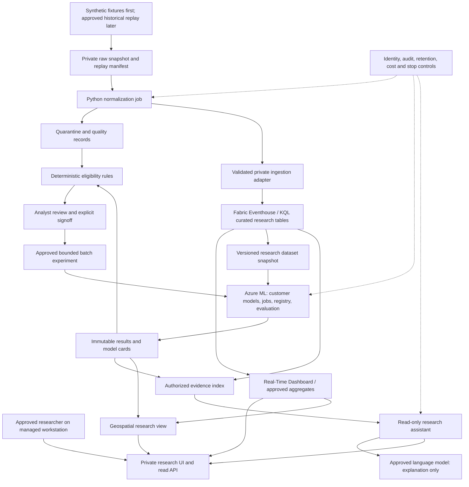

# DRDC Research Productivity Bundle

**PRIVATE — customer-validation concept | 14 September 2026**

An actionable proposal for human-supervised research, data quality, reproducibility and explainability. **Not a verified deployment, comprehensive inventory, Microsoft commercial SKU, support commitment, accreditation, procurement approval or deployment authorization.** Keep this document in the private engineering workspace; it is not approved for the stakeholder website.

## Account-team quick view

**Positioning:** help researchers spend less time preparing data, reproducing jobs and finding the evidence behind a result. Start with their existing research code and expertise rather than replacing them with a generic chatbot. The proposed Microsoft building blocks are Fabric for research data and quality views, Azure Machine Learning for reproducible model work, and a separately approved language-model assistant for evidence-linked explanations.

| Team's problem | Select from the bundle | What the first demonstration should show |
|---|---|---|
| Preparing and checking research data takes too much effort | **M1: Streaming research data foundation** | Synthetic replay with visible quality defects, record accounting and a reviewed dashboard. |
| Research jobs are difficult to repeat outside one workstation | **M6: Repeatable cloud research jobs** | One packaged Python job with matching local/cloud outputs and a recoverable failed run. |
| Model results are difficult to reproduce and compare | **M2: Governed model lifecycle** | A traceable baseline/candidate comparison with data, code and model versions. |
| Researchers need to understand which inputs support which model | **M3: Quality-aware orchestration research** | Deterministic eligibility reasons and abstention, followed by explicit analyst approval of a bounded experiment. |
| Finding the evidence behind a result is slow | **M4: Evidence-linked research assistant** | A read-only explanation with checked citations, uncertainty and permission enforcement. |
| Spatial research results and data gaps are hard to inspect | **M5: Geospatial research view** | Approved synthetic quality/coverage layers with timestamps and provenance. |

**Recommended first selection: M1 + M6.** Prove a useful data-and-job slice before adding M2/M3; offer M4/M5 when stable, authorized evidence exists. Modules are selectable implementation workstreams, not six ready-to-install products. Reuse existing approved services where suitable; each addition needs its own support, cost and acceptance decision.

**How to use this in a meeting:** choose one research bottleneck, identify its owner and agree a measurable first outcome. Use the module table below for Microsoft components and code starting points, the architecture in section 3 for the design discussion, and sections 5-7 for tenant prerequisites and pilot acceptance. The next decision is discovery and scope, not buying capacity or approving the entire stack.

**Room for more projects:** this is not an inventory of all DRDC work. Ask other research teams about document/evidence discovery, reproducible data preparation, experiment reporting and engineering documentation. These are discovery prompts from the wider catalog, not assertions that those projects exist. Add a workstream only after its owner confirms the problem, permitted data, source/package, delivery responsibility and pilot measures.

## 1. Need, confidence and recommended starting point

The demand signal is **two identical pasted AI-generated meeting summaries: ONE unverified source, not independent corroboration**. The requirements below are a minimized interpretation pending customer validation. Personnel names, quotations, raw meetings, operational/exercise details and customer environment identifiers are intentionally not retained. Public product documentation verifies product capabilities, not the meeting summary or customer requirements.

The proposed research needs are:

- Explore maritime research data using synthetic AIS/radar-like observations and MQTT-shaped messages, then separately approved historical replay.
- Normalize streams through Python and KQL; make data quality and provenance visible in Fabric Eventhouse and dashboards.
- Manage **customer-owned prediction models** reproducibly, including their evaluation and limitations.
- Research quality-aware algorithm selection using deterministic eligibility rules and analyst signoff.
- Provide a read-only assistant that explains research results with evidence links and explicit uncertainty.
- Visualize geospatial research results and move repeatable Python jobs into governed cloud execution.

**Recommendation:** begin with a small synthetic replay → Python normalization → private Eventhouse/KQL → quality dashboard slice. In parallel, package one Python job reproducibly. Add model lifecycle, deterministic selection research, the evidence assistant and geospatial views only after the data contract and private connectivity pass. Do not deploy a whole accelerator stack merely to demonstrate this slice.

### Confirm with the customer before implementation

The research lead and data steward must agree on the research question, data rights/classification, permitted outputs, historical-data admission rules, input formats/units, expected data volumes, replay speed and retention. The model owner must identify the existing Python runtime, dependencies, model artifacts, licenses, baseline, evaluation metrics and acceptable error. The platform owner must confirm tenant/service availability, approved regions, workspace boundaries, identities and budget.

The first discovery deliverable is a short, approved pilot charter with these decisions and the acceptance measures in §7. Do not infer real-time latency requirements, live feed access, model performance or existing tenant resources from the summary.

**Scope boundary:** no targeting, tactical recommendations, operational prioritization, autonomous operational decisions, live command/control, device actuation or outbound instructions to data-producing systems. Predictions are labeled research outputs. Humans own research interpretation and all consequential decisions. A later request crossing this boundary requires separate review; it is not an extension authorized by this concept.

## 2. Six modules and portfolio fit

Status terms apply narrowly:

- **Bounded-test reuse candidate:** selected prior lab workflows passed; the custom research integration and JDCP deployment remain untested.
- **Inspected / prerequisite-gated:** source or templates were reviewed, but the relevant application workflow was not validated.
- **New custom integration:** no end-to-end implementation or acceptance result exists here.
- **Public sample only:** first-party source and a snapshot were verified, not built, executed or evaluated.

Source IDs refer to §9. Portfolio numbers refer to the existing private commercial recommendation, not a new inventory.

| Module | Research problem → intended outcome | Recommended components and initial deliverable | Portfolio / source starting point | Honest readiness |
|---|---|---|---|---|
| **M1 — Streaming research data foundation** | Inconsistent timestamps, schemas and quality obscure results → reproducible replay with visible completeness, freshness and exceptions. | Python parsers/validators; private Blob/ADLS raw and quarantine storage; Fabric Eventhouse/KQL database; KQL querysets and Real-Time Dashboard. Add Eventstream/Event Hubs only where the exact private route is supported. Deliver versioned schema, replay manifest, normalization tests and quality dashboard. | #17 Real-Time Operations Intelligence [U1]; #16 Unified Data Foundation [U2] for optional governed-data patterns; Fabric [D1–D3]. **AIS/radar parsers, MQTT-to-canonical bridge and replay driver are custom; no matching reviewed repo is established.** | U1/U2 were prerequisite-gated and not functionally tested. All domain ingestion and cross-service wiring are new. |
| **M2 — Governed model lifecycle** | Python experiments are hard to reproduce or compare → traceable customer-owned model versions and signed evaluation packages. | **Azure Machine Learning** SDK v2 jobs/pipelines, versioned data/model/environment assets, MLflow tracking, registry and batch scoring. Deliver one baseline and one customer-approved candidate on a fixed holdout. | New Azure ML examples [U7], lifecycle guidance [D4]. #14 platform baseline [U6] is a design reference only, not a prediction-model accelerator. | Public samples only; lifecycle integration, compute and models untested. Model ownership and scientific validity stay with the customer. |
| **M3 — Quality-aware orchestration research** | Algorithm eligibility changes with missing/stale/uncertain inputs → explainable, reproducible selection experiments with safe abstention. | Small versioned Python rules package; explicit state machine; eligibility table; analyst approval record; bounded Azure ML batch experiment. Deliver a rule decision log linked to input, model and approval versions. | Related analytics context: #17 [U1]. **Custom build; no reviewed algorithm-switching repository.** Generic multi-agent automation (#2) is not a substitute for deterministic control. | New, untested integration. LLMs neither select algorithms nor authorize execution. |
| **M4 — Evidence-linked research assistant** | Analysts cannot easily connect results to data/model versions → cited explanations, comparisons and explicit “insufficient evidence.” | Private read-only application; Entra authorization; permission-filtered retrieval; approved Azure OpenAI model through a supported Foundry/Azure OpenAI configuration; immutable evidence links. Start with approved research notes, schemas, quality reports and model cards—not raw streams. | #1 CWYD [U3] preferred narrow starting point; #4 DKM [U4] if document extraction/comparison is needed. | Bounded-test reuse candidates; permission enforcement, immutable historical links, research grounding and private hosted experience remain custom acceptance gates. |
| **M5 — Geospatial research view** | Spatial distributions and data gaps are hard to inspect → time-filtered, provenance-linked research maps showing quality and uncertainty. | Private view over approved result snapshots/KQL aggregates; coordinate-reference and unit validation; quality overlays; optionally Azure Maps REST/Web SDK after private-path testing. Deliver synthetic coverage and data-quality layers with drill-through to evidence. | #10 Planetary Explorer is **inventory-only, owner-gated**, with no reviewed public repo/pin established here. Azure Maps code samples [U8] are a separate new starting point, not Planetary source. | New custom view; Maps samples untested. No operational map, live situational-awareness feed or tactical recommendation. |
| **M6 — Repeatable cloud research jobs** | Local Python jobs depend on workstation state → repeatable, bounded cloud runs with accountable costs and recoverable outputs. | Pinned Python environment/container; private registry/storage; Azure ML jobs for model-related work. Use Azure Container Apps Jobs for finite non-ML normalization/report jobs if a separate runner is justified. Deliver one migrated job plus parity, restart and failure tests. | #9 Modernize Your Code [U5] offers reviewed failure-handling lessons, **not a tested Python migration path**. Azure ML examples [U7]; Container Apps Jobs [D6]. | Migration/runner integration is custom. Prior Modernize tests concerned SQL translation, not Python-job equivalence. |

### What the prior evidence actually supports

- **CWYD:** eight selected business criteria passed in an adapted-local workflow. This was not an unchanged cloud deployment, full Functions-host validation or an interactive browser walkthrough. Old snippets survived replacement, but immutable historical document download URLs were not proved. The manifest has upstream provenance but no selected dirty CWYD overlay; do not imply the entire evaluated runtime is packaged for replay.
- **DKM:** selected ingestion, document-scoped QA and two-document comparison passed. Only two of ten fixtures were ingested; summaries had grounding defects; the full browser journey remained blocked. Reviewed retry/configuration adaptations exist, but are not a research-quality guarantee.
- **Modernize:** selected adapted API/worker upload/process/download and failure handling passed. Source/target database equivalence was not established. It does not validate arbitrary Python rewriting.
- **Fabric U1/U2:** cloned, pinned and inspected; earlier lab prerequisites prevented application execution. Those historical lab blockers are **not** findings about the present customer tenant.
- **Platform U6:** template compilation only, no deployed application outcome. Optional Fabric/Purview paths need their own approvals. Historical mirroring defaults that relax isolation are not acceptable for this bundle.
- **Planetary Explorer / SpecSuite:** protected, inventory-only in the prior exercise; no reuse, access, performance or support entitlement is inferred. SpecSuite is not required for the initial Python packaging task.

These are prior synthetic lab observations, not new tests, customer success claims or evidence of accreditation. All six assembled modules remain a **proposed custom bundle**.

## 3. Private concept architecture and decisions

### Logical architecture

Solid arrows show proposed application data flow, **not validated network connectivity**. Fabric and Azure ML are managed services outside the customer spoke; every arrow crossing a service boundary needs the §5 service/connector matrix. All outputs are research-only.

`E → EV` means an approved, immutable research evidence snapshot, not unrestricted indexing of the database. A distinct ingestion identity writes that index; the assistant has read-only permissions. The assistant has **no path to the approval, model-promotion or job-execution interfaces**.

**Platform boundary:** Azure ML manages custom numerical/prediction model lifecycle and compute. Foundry/Azure OpenAI supplies only a separately approved language-model path for explanations. This design does not claim that Foundry hosts arbitrary numerical models or that an LLM evaluates scientific correctness.

### Proposed ADR-DRDC-001 — Start with replay, not continuous ingestion

**Status: Proposed, pending pilot charter.**

| Option | Benefit | Cost / limitation |
|---|---|---|
| **A — Synthetic replay and finite jobs (recommended)** | Reproducible defects, bounded spend, easier privacy review and rollback; useful before live integrations exist. | Does not prove continuous ingestion, production latency or reliability at scale. |
| **B — Continuous ingestion through additional broker/stream components** | Tests sustained load and streaming transformations. | More identities, network dependencies, connector constraints and operating cost before scientific value is demonstrated. |

Use A first. MQTT is a transport, not an AIS/radar data schema. Start with MQTT-shaped replay files; use a separately approved broker and one-way subscriber/normalizer only if broker semantics become a test objective. Event Grid MQTT is a Microsoft option [D7], **not a promised direct private connector to Eventhouse**. Do not add command topics or device-control flows.

### Proposed ADR-DRDC-002 — Keep control deterministic and small

**Status: Proposed, pending model-owner approval.**

Prefer a versioned rules package plus explicit approval records over an LLM/multi-agent controller. This gives reproducible decisions and clear authority at the cost of maintaining rules and waiting for analyst review. A general agent framework adds routing and failure states without solving the core quality-policy requirement; it is not selected.

Begin with one application codebase containing clear normalization, quality-policy and evidence-access modules, plus separately authorized job and read services. Do not introduce microservices for each rule. Domain rules accept typed records and return decisions; SDK/database/HTTP adapters remain outside those rules.

### Proposed ADR-DRDC-003 — Reuse a runner before adding another

**Status: Proposed.**

Use Azure ML jobs for preprocessing/training/scoring when one lineage system suffices. Container Apps Jobs are an alternative for finite non-ML tasks, trading a simpler container execution model for another scheduler, identity and monitoring surface [D6]. Fabric notebooks are another possible tenant-native route, but require separate dependency, private-network and cost validation; they are not a prerequisite.

## 4. Data, quality and explanation contracts

### Canonical research record

Define a versioned schema before ingestion: synthetic source identifier; source message identifier; stable event identifier; event time and ingestion time in UTC; schema version; source kind; typed measurements with units; declared coordinate reference system where applicable; missingness and quality flags; raw snapshot/hash reference; transformation version; and replay run identifier. Use fabricated entity identifiers, not authentic vessel/person identifiers, in synthetic tests.

Store raw synthetic input immutably within the agreed retention period. Keep normalized records, quarantine records and derived results distinguishable; never overwrite the raw sample to hide a normalization error. Define event-key deduplication, out-of-order handling, late-arrival window, schema evolution and unit conversions explicitly. Do not claim end-to-end exactly-once delivery: test logical idempotency under replay/retry.

KQL should calculate transparent counts, completeness, time lag, invalid-value rates and source-specific coverage. Python handles domain parsing and transformations requiring customer code. Missingness, staleness, confidence and model error are different quantities; do not collapse them into an unexplained universal quality score. A position gap is a data-quality observation, not an inferred real-world event.

### M2/M3 research contract

1. Register the customer's baseline and candidate model, permitted input schema, training-data snapshot, dependency lock/image digest, parameters, seed and model card.
2. Choose temporal/entity-aware holdouts where appropriate; prevent leakage from replay ordering, preprocessing and tuning. Publish metrics separately by quality condition and relevant synthetic input category.
3. For a fixed input window, deterministic rules check missingness, staleness, schema/units and each model's approved input envelope. Thresholds are scientific hypotheses requiring model-owner agreement, not vendor-supplied defaults.
4. Return `eligible`, `ineligible` or `unknown`, with rule version and reasons. Unknown/out-of-envelope input means **abstain or quarantine**, not an LLM choosing another algorithm. A fallback is allowed only if independently evaluated for that condition.
5. An analyst signs the proposed experiment with fixed dataset hash, rule version, model versions, scope and expiry. Changed inputs/versions, revoked approval or expiry invalidate the approval. No unattended promotion or runtime switching is permitted.
6. A separate, authorized runner executes only the signed, bounded batch. Record proposed selection, actual model used, approver reference, execution status, output hash and evaluation. Store individual approval identities only in the approved audit system, not this document.

### M4/M5 research contract

- Enforce user authorization at both retrieval and source download. A prompt instruction is not access control. If using AI Search instead of CWYD's evaluated pgvector path, label it a **new retrieval adapter** and retest permissions and retrieval quality.
- Start with curated notes, schemas, quality summaries and model cards. Optionally expose only allowlisted parameterized read queries with row/time limits and authorization checks; never execute arbitrary LLM-generated KQL, Python or shell code.
- Evidence links resolve to immutable dataset/result/document versions, KQL query/version and time window, and model/run versions. Display data age, known gaps and whether a statement is an observation, model output or language-model explanation.
- Treat retrieved text as untrusted content, not executable instructions. Refuse unsupported claims; do not fabricate citations or causal explanations. Statistical feature attributions, if supplied by the model owner, are not proof of causality.
- Map only approved research layers. Show gaps, timestamps, coordinate reference system and uncertainty; do not interpolate missing observations silently. Avoid sending sensitive coordinates in map/search/geocoding requests.
- Begin with a private static research plot if an interactive map's tile, SDK, font or data endpoint cannot pass the private-network review. This is a reduced research view, not permission to enable public fallback.

## 5. How to start in the Azure tenant: approval and landing-zone gates

**This section describes later owner-executed work. No deployment, inference, provider registration, role assignment, capacity purchase or cloud mutation is authorized by this document.** Existing lab allowances remain closed; do not resume historical scripts, use protected applications or copy old lab resource parameters.

### Gate 0 — Obtain decisions before creating anything

The research lead, data steward, security authority, JDCP platform owner and FinOps owner approve the charter. Select an existing approved landing zone and region rather than creating a new platform by default. Confirm service eligibility for the data classification/residency requirements, tenant home region, Fabric capacity region, model availability, quotas and applicable previews. A Canada-located resource group does not establish processing residency.

Record a resource/dependency plan privately in the approved delivery system: existing versus proposed services, SKU, owner, data flows, classification, retention, private endpoint subresources, consumer identities and cost cap. Keep actual tenant/subscription/resource identifiers out of this concept. Any new subscription-level registration, Entra application, consent, elevated role or service capacity is a distinct approval item.

### Gate 1 — JDCP private networking and identity

The **current integrated-DNS private-endpoint SOP takes precedence** over the deprecated policy-only flow and the ambiguous checklist shorthand in the local skill:

1. Place customer-managed private endpoints in the approved spoke PI/PE subnet, with JDCP-approved subnet, NSG and routing design.
2. Disable public network access on all target PaaS services; for Fabric use the applicable supported private-link and public-access-blocking controls. Establish the controls before admitting data. An IP allowlist is not a substitute for a private-only design.
3. Bind each endpoint's **integrated DNS zone group to the existing central hub private DNS zone**. IaC uses an existing-zone reference and the endpoint's `privateDnsZoneGroups` child; it must not create a spoke zone.
4. **No spoke-local `privatelink.*` zones. No “DNS integration = No” plus legacy central-DNS policy flow.** Do not add a spoke DNS-forwarder VM, ad hoc conditional forwarders or hosts-file overrides.
5. JDCP confirms every required central zone and its links to **both regional hub VNets**. If a zone is missing, request central creation/linking from Cloud Ops; stop the dependent service until complete.
6. Hub-zone writes require approved, scoped RBAC, normally PIM-activated. If the delivery team lacks that access, JDCP performs the integration; do not work around authorization failures. JDCP prefers recreating incorrectly wired endpoints under change control; in-place repointing needs Cloud Ops confirmation. Neither is authorized here.
7. From the approved in-VNet workstation/runner, prove normal service FQDNs resolve to the intended private IPs, endpoint connections are approved, TLS validates and authorized data access works. Also prove off-path/public access and unauthorized identities are denied. A private DNS answer alone is not a complete connectivity test.

Apply these rules instead of generic public tutorials that auto-create local DNS zones. Azure ML/Fabric **service-managed networks are distinct from the customer spoke**; JDCP must approve their service-managed endpoint/DNS behavior and egress topology. Do not assume their outbound traffic traverses the spoke Fortigate or that an inbound workspace PE secures managed compute egress.

Use Entra groups for research readers, data maintainers, model owners, job operators and platform administrators; managed identities or approved workload identity federation for services. Separate deployment rights from runtime data rights and assistant-read rights from ingestion/write rights. PIM is for approved elevation, not permanent runtime privilege. Review exact role actions: broad job-operator/contributor roles can include secret-read permissions [D6]; use a reviewed narrower role where needed.

### Gate 2 — Approve every service-to-service route

| Dependency | What must be demonstrated with public access blocked | Stop / reduced-scope response |
|---|---|---|
| **Fabric Eventhouse/Eventstream** | Tenant/workspace private-link support for the chosen item, connector, authentication and ingestion mode; source-side connectivity as well as inbound Fabric access; KQL and dashboard access from approved clients. | Stay with local synthetic normalization if no approved route exists. Do not declare Fabric delivered or enable public access. |
| **Azure ML** | Private workspace access plus separately controlled compute egress to storage, registry, tracking and required services. Assess “allow only approved outbound” and its service-managed dependencies/costs [D5]. | No compute job until the full dependency graph passes. A workspace PE is insufficient evidence. |
| **Assistant** | Private application, retrieval store, source-download and language-model paths; supported model/API/region; end-user permission filtering and runtime identity. | Demonstrate deterministic evidence browsing without generation until inference and network approvals exist. |
| **Azure Maps** | Account-specific private REST endpoint, hub DNS integration and public access disabled. Test actual SDK version and browser tile/script/font requests from approved clients [D8]. | Use a private static research plot if any required path is unsupported. Do not fall back to the default public Maps endpoint. |
| **Python jobs / optional MQTT** | Private storage/registry, approved package/build provenance, supported compute network mode and one-way replay ingestion. Broker private connectivity and downstream connector compatibility are separate checks. | Keep file replay. No live source connection, command topic, automatic download from arbitrary feeds or public endpoint exception. |

**Important current Fabric limitations:** Microsoft’s private-link overview [D3], checked on the date above, lists unsupported Eventstream custom-endpoint sources/destinations and Eventhouse **direct-ingestion-mode** destinations; Eventhouse queued ingestion and connectors relying on it are also unsupported under the documented private-link scenario. It also lists restrictions on OneLake ingestion, pipeline connections and T-SQL access to Eventhouse. Data-agent access to Kusto/semantic/mirrored sources has private-link limitations. Therefore:

- Do not promise `Event Hubs → Eventstream → Eventhouse` until the precise mode and both network directions are validated.
- Prefer a small supported private ingestion proof, such as an appropriate streaming-ingestion API/SDK path, **only after its support and identity requirements are confirmed**. A diagram or the general Eventhouse connector list [D2] is not proof.
- Do not make a Fabric Data Agent, Copilot, Activator, mirroring, OneLake shortcut or preview SDK a pilot dependency. Where workload-specific guidance differs, resolve it with the service owner before implementation.

Azure Maps documentation [D8] confirms private REST API access through an **account-specific hostname**; the default public endpoint does not route through that PE. It does not certify this custom Web SDK implementation. Its generic local-zone creation instructions must be replaced with JDCP central existing-zone integration.

### Gate 3 — Egress and cost authorization

Customer-spoke outbound traffic follows the approved Fortigate/NVA path. Cloud Ops must approve required flows/service tags for control plane, identity, monitoring, package feeds, image registries and any permitted external dependency. Use approved package/image mirrors where feasible. Do not bypass the firewall, disable TLS checks, use unmanaged tunnels, broaden ingress or temporarily open storage/Key Vault to make a sample work.

Raise the JDCP Cloud Ops request through the established internal process. Include project/purpose, public-connection requirement, data classification, security intake reference if required, environment, certificate ownership if applicable, existing flow/policy reference, subscription reference, source/destination networks and port/service. Actual identifiers belong in that ticket, not here. Request central DNS zone/dual-hub links, endpoint integration and PIM/RBAC actions explicitly; no blanket internet-egress request.

### Prerequisites, licensing and cost boundaries

| Area | Required decision | Costs / license boundary |
|---|---|---|
| **Fabric** | Tenant enablement/admin approval; licensed authors/viewers; approved workspace/capacity and region; provider registration if creating Azure F capacity; pause/retention policy. Verify the chosen accelerator's current prerequisites rather than treating the old lab's F2 observation as sizing advice. | **Separately billed Fabric capacity and applicable storage/Power BI licensing.** Dashboard viewer rights vary with licensing/capacity. No included Fabric entitlement from PTUs; pausing may leave retained-data and other charges. |
| **Azure ML / jobs** | Workspace and compute quotas, customer model/dependency rights, private storage/registry, reproducible environment, maximum run duration/concurrency and retry count. No GPU unless justified. | CPU/GPU/job compute, storage, registry, networking, managed-network firewall and monitoring can be chargeable independently. Scaled-to-zero execution does not imply zero total cost. |
| **Assistant** | Approved model/version/API/geography, inference budget, permission-aware retrieval, application hosting, evaluation corpus; optional extraction approval. | Language-model and embedding deployments, search/database, hosting and optional Document Intelligence are distinct costs. OCR and geospatial compute are not chat PTU usage. |
| **Maps** | Approved account, private path, map/data license and permitted geographic data usage. | Maps transactions, hosting, private endpoints and licensed data are additional; open-source sample code does not confer free map-service use. |
| **Source/software** | Review pinned licenses/notices and transitive dependencies; agree customer code/model IP, implementation ownership and maintenance responsibilities. | The referenced repositories report MIT licensing, but upstream code, new custom work, dependencies, model weights and services have separate terms. The private collection grants no blanket license or Microsoft support entitlement. |
| **Shared platform** | Reuse approvals, scoped identities, logging/retention, budget attribution, backup/recovery and teardown owner. | Private endpoints, firewall, data transfer, retained storage, monitoring and delivery/support effort remain chargeable even when model calls stop. |

**PTU boundary:** compatible Azure OpenAI generation may later use an approved provisioned deployment after model/version/API/geography/routing and capacity checks. Do not imply that Azure ML models, Fabric, Maps, ingestion or all Foundry features consume the same PTU allocation. Measure useful task demand first; compare approved consumption-based service options before any commitment. No PTU purchase or reservation is recommended merely to start this pilot.

FinOps must agree a currency-specific total cap and service sub-budgets before execution. Record attempt/retry and job-time ceilings, daily cost review, capacity schedule, pause/expiry dates and retained-resource costs. **Budget alerts are not hard spend caps**; runner admission limits and an accountable stop owner are required.

## 6. Sequenced synthetic-data pilot

Indicative planning sequence, **not a delivery-date commitment**. Progress by exit evidence rather than calendar alone. Artifacts listed below are future private deliverables; they were not created by authoring this concept.

| Stage | Owner-led work after approval | Required exit evidence |
|---|---|---|
| **P0 — Validate and bound** | Research lead validates the single-source interpretation. Agree one question, one Python job, one baseline/candidate pair, synthetic-data generator contract and §7 thresholds. Platform/FinOps decide service/network path and budget. | Approved charter, ownership matrix, data/flow plan and explicit authorization for the next stage. Missing approvals stop here. |
| **P1 — Offline reproducibility** | Data engineer builds a fixed-seed synthetic set with missing fields, duplicate/out-of-order records, stale timestamps, invalid units/coordinates and schema changes. Job owner freezes one Python environment and expected outputs. No cloud/model calls required. | Versioned schema, fixtures and input/output hashes; normalization/quarantine tests; local baseline; dependency/license review. |
| **P2 — Private tenant feasibility** | Authorized platform team establishes approved resources/configuration and central DNS integration. Test ingress, egress and least privilege with synthetic content only. Fabric owner validates the exact ingestion/query/dashboard route. | §5 network matrix signed off, negative access tests, cost controls and no public fallback. Unsupported services remain undelivered. |
| **P3 — Data and job vertical slice (M1/M6)** | Replay synthetic records at the agreed rate; normalize, quarantine and ingest; expose KQL quality metrics. Execute the selected job with bounded retry and restart. | Record reconciliation, visible quality defects, dashboard checks, local/cloud parity, restart recovery, cost/run report and rollback exercise. |
| **P4 — Model and quality experiments (M2/M3)** | Register customer assets, run baseline/candidate evaluations, exercise deterministic eligibility rules and explicit signoff/expiry. Force unknown/out-of-envelope conditions. | Versioned model cards, leakage review, quality-stratified results, approval-to-run trace, abstention and stale-approval tests. No auto-promotion. |
| **P5 — Explanation and visualization (M4/M5)** | Add an authorized evidence corpus and map/plot. Test citation/version fidelity, missing evidence, permission boundaries, adversarial retrieved instructions and uncertainty display. | Human-reviewed answers and citations; unauthorized-access denials; map/data alignment and clear synthetic/research labels. |
| **P6 — Review and decide** | Research lead compares task effort and scientific usefulness against the baseline. FinOps reconciles costs; platform/job owners test pause/recovery. | Signed continue/change/stop decision. Only a new data-rights/security approval can admit historical datasets; live/operational use is not an exit outcome. |

## 7. Acceptance measures — proposed targets needing agreement

These are **testable proposals, not observed results, SLAs or scientific performance promises**. Agree load, hardware, dataset, evaluator rubric and tolerances at P0; keep failures and denominators visible. Safety/access failures block progression even if an aggregate score is good.

| Measure | Proposed target / method | Accountable reviewer |
|---|---|---|
| **Data accounting** | For a 100,000-record synthetic fixture, reconcile 100% of input records into accepted, duplicate or quarantined dispositions. Replaying the same run produces zero additional logical events; explain every discrepancy. | Data steward / data engineer |
| **Quality correctness** | Detect 100% of explicitly injected deterministic schema/unit/range failures, with zero clean-fixture false positives in the fixed test set. Evaluate probabilistic quality metrics separately; this is not real-world accuracy proof. | Data steward |
| **Research freshness** | At 100 records/second for 30 minutes, proposed P95 arrival-to-queryable latency ≤30 seconds; dashboard refresh ≤60 seconds. Measure event-time lateness separately. Revise load/targets before testing, not retrospectively to hide failure. | Fabric owner / research lead |
| **Job reproducibility** | Three reruns of the selected job give matching outputs within an agreed numerical tolerance; all have input/code/environment/output provenance. Forced interruption/retry loses zero accepted logical records and creates zero duplicate final publications. | Python job owner |
| **Model evaluation** | Every run records model/data/code/environment versions and split definition. Candidate must meet a customer-defined metric and non-regression tolerance for each agreed quality slice; **no numerical improvement target is asserted without a model/task**. | Customer model owner |
| **Deterministic control** | 100% of rule cases match their expected eligibility/abstention; zero runs occur without valid, unexpired signoff; all changed-input/version and revocation cases block. Zero LLM-driven selection/promotion or device-control calls. | Model owner / security reviewer |
| **Assistant evidence** | On 40 agreed questions: ≥95% correct claim-to-source/version links under human review; 100% no-answer on deliberately unsupported questions; zero unauthorized retrieval/downloads in cross-role tests. Unsupported material claims block release regardless of average. | Research lead / data steward |
| **Geospatial fidelity** | All approved synthetic layers match source coordinates within declared numeric/CRS tolerances; gaps and age remain visible; zero unauthorized external coordinate/data transmissions. | Geospatial reviewer |
| **Private access** | All approved paths work and all tested public/off-path/unauthorized paths fail. Every customer-managed PE has a central hub-zone group; no spoke private DNS zone or bypass exists. | JDCP/platform owner |
| **Usefulness and cost** | Proposed ≥20% median reduction in preparation/explanation time over five paired research tasks without worse reviewed correctness; report small-sample limitations. All spend stays within agreed caps, with retained costs itemized and pause/recovery demonstrated. | Research lead / FinOps |

## 8. Operating ownership and stop gates

| Role, not a personnel assignment | Ongoing responsibility |
|---|---|
| **Research lead / product owner** | Validates requirements, scientific usefulness, permitted outputs and human signoff; accepts or stops the pilot. |
| **Customer data steward** | Data rights/classification, schema, quality definitions, retention, permitted exports and historical-data admission. |
| **Customer model owner** | Model IP, training/evaluation, domain validity, input envelope, rule thresholds, model cards and version promotion. |
| **JDCP Cloud Ops / landing-zone owner** | Central DNS, hub links, endpoint/network integration, approved egress, PIM access and change control. |
| **Fabric / Azure platform owners** | Service licensing/capacity, workspace administration, availability/private-path checks, backup/recovery and resource lifecycle. |
| **Application and Python job maintainers** | Code/dependency updates, tests, identity separation, observability, idempotency, approval enforcement and rollback. |
| **Security and privacy authorities** | Classification/residency, access tests, retention/export controls, risk acceptance and incident handling. |
| **FinOps / service owner** | Cost cap, attribution, capacity schedules, stop authority and retained-resource review. |

Each role needs an actual accountable owner in the approved delivery system before P2. Source availability is not a support arrangement.

**Stop immediately** for absent data rights/classification, real data introduced without approval, prohibited operational requests, unauthorized evidence disclosure, unsupported private connectivity, unapproved preview/service/region, missing central DNS/PIM/egress permissions, stale approvals, out-of-envelope model inputs without an evaluated fallback, irreproducible results, material unsupported explanations, or exhausted spend/run limits.

The approved stop procedure blocks new replay/job/inference admission, revokes pending approvals, and pauses relevant capacity/compute only through authorized change control. Preserve evidence and raw inputs under the retention policy; do not delete resources or rewrite failed results to improve the score. Mark dashboards/results stale. Recovery requires the owning role to resolve the cause, re-run relevant negative tests and issue fresh approval. No fallback to public networking or unreviewed algorithms.

## 9. Source register and provenance

### Existing portfolio sources and reviewed upstream pins

The following **full base commits were read from the private adaptation manifest**, not inferred from branch tips. Prior public-origin/MIT verification is recorded in the archive as 13 September 2026 UTC. No upstream application was rebuilt or rerun for this document. Reuse requires license preservation, dependency review and new tenant-specific testing.

| ID | Public upstream | Reviewed base commit | Reuse boundary |
|---|---|---|---|
| **U1** | [Real-Time Intelligence Operations](https://github.com/microsoft/real-time-intelligence-operations-solution-accelerator) | `cfbdb91ee83ed31b5ccc5de7feca7a0b5b2e5f68` | Inspected, prerequisite-gated; no selected dirty overlay. |
| **U2** | [Agentic Applications for Unified Data Foundation](https://github.com/microsoft/agentic-applications-for-unified-data-foundation-solution-accelerator) | `28c25024e43884b0a23c996d5cc8d3419f4e448c` | Inspected, prerequisite-gated; not a required agent layer. |
| **U3** | [Chat With Your Data](https://github.com/Azure-Samples/chat-with-your-data-solution-accelerator) | `0fce71307dfa76a82ac82ec73bdde3daa47e503d` | Bounded adapted-local workflow; no selected dirty overlay in archive. |
| **U4** | [Document Knowledge Mining](https://github.com/microsoft/Document-Knowledge-Mining-Solution-Accelerator) | `7df8ed33a86dd4f0f9e7417e882039fd38556e59` | Reviewed patch/authored files under `adaptations/first-pass/dkm/`; partial app evidence. |
| **U5** | [Modernize Your Code](https://github.com/microsoft/Modernize-your-code-solution-accelerator) | `7592ea97550fb711d7d8b64186875967d574c5d5` | Reviewed patch under `adaptations/first-pass/modernize/`; SQL workflow, not Python migration proof. |
| **U6** | [Deploy Your AI Application In Production](https://github.com/microsoft/Deploy-Your-AI-Application-In-Production) | `1ed62d982f777b85f3fe281adfd7150921ccd9ce` | Compiled template only; not a JDCP landing-zone deployment recipe. |

### New first-party public starting points

Repository visibility/license metadata and README at each exact commit below were checked against GitHub on **14 September 2026** using public-only repository requests. These are **discovery snapshots, not reviewed adaptations or tested integrations**; transitive dependencies and source implementation remain to be reviewed.

| ID | Public source and snapshot | Verified purpose / limitation |
|---|---|---|
| **U7** | [Azure ML examples](https://github.com/Azure/azureml-examples/tree/86d53a35d2ecc33ff40c669cc1389b06899e5a4b) — `86d53a35d2ecc33ff40c669cc1389b06899e5a4b` | Public, MIT; SDK v2/CLI examples and tutorials. Start by reviewing one job/pipeline example, not executing every example. |
| **U8** | [Azure Maps Code Samples](https://github.com/Azure-Samples/AzureMapsCodeSamples/tree/e1208dbdd768cc3cd315aa60fc3edeea77e4590b) — `e1208dbdd768cc3cd315aa60fc3edeea77e4590b` | Public, MIT; Web SDK examples. No research-domain implementation or private-network runtime validated. |

For eventual approved reuse, follow [the adaptation restoration guidance](../adaptations/README.md): use a new isolated checkout at the full manifest SHA, verify any selected patch and hashes, preserve notices and review configuration before build. Do not substitute `main`, copy credential-bearing configuration or enable archived provider harnesses. This concept includes no source-restoration or deployment execution.

### First-party product documentation checked on 14 September 2026

These links were opened and their relevant content checked. They document product capabilities/limitations, not compatibility or availability in the customer tenant. Recheck the exact service, region, API and connector at P2. Public lookups contained only public product/repository terms, never customer context or internal content.

| ID | Microsoft source | Why it matters |
|---|---|---|
| **D1** | [Fabric Real-Time Intelligence overview](https://learn.microsoft.com/en-us/fabric/real-time-intelligence/overview) | Streaming/time-based analytics, exploration and visualization building blocks. |
| **D2** | [Eventhouse overview](https://learn.microsoft.com/en-us/fabric/real-time-intelligence/eventhouse) | Event-oriented storage and KQL databases; general connector descriptions do not override private-link limitations. |
| **D3** | [Fabric Private Link overview and workload limitations](https://learn.microsoft.com/en-us/fabric/security/security-private-links-overview) | Inbound private access versus outbound data-source connectivity; Eventstream, Eventhouse and data-agent restrictions. |
| **D4** | [Azure ML model management / MLOps](https://learn.microsoft.com/en-us/azure/machine-learning/concept-model-management-and-deployment?view=azureml-api-2) | Reproducible pipelines/environments, registration, lineage and model lifecycle. |
| **D5** | [Azure ML managed network isolation](https://learn.microsoft.com/en-us/azure/machine-learning/how-to-managed-network?view=azureml-api-2) | Inbound workspace PE and managed compute outbound isolation are different; approved outbound dependencies can add cost. |
| **D6** | [Azure Container Apps Jobs](https://learn.microsoft.com/en-us/azure/container-apps/jobs) | Finite manual/scheduled/event-driven jobs and job-role permission caveats. |
| **D7** | [Event Grid MQTT overview](https://learn.microsoft.com/en-us/azure/event-grid/mqtt-overview) | MQTT broker capability only; no implied private end-to-end Fabric integration. |
| **D8** | [Azure Maps private endpoints](https://learn.microsoft.com/en-us/azure/azure-maps/private-endpoints) | Account-specific private REST endpoint and explicit public-access disablement; override generic local DNS setup with JDCP rules. |

### Private evidence and policy trail

Read for this concept, summarized rather than copied:

- [Repository scope](../README.md), [contributor rules](../AGENTS.md) and [publication boundary](PUBLICATION.md).
- [Private commercial recommendation](../PTU-Bundle-Commercial-Recommendation.md): portfolio mapping and later qualifications take precedence over earlier broad readiness/PTU claims.
- [Adaptation manifest](../adaptations/manifest.json) and [archive README](../adaptations/README.md): exact origins/pins, preserved overlays, omissions and license provenance.
- [CWYD report](../reports/cwyd.md), [DKM current summary](../reports/documents-current-summary.md), [Modernize report](../reports/modernize.md), [continuation report](../PTU-Bundle-Continuation-Report.md) and [protected-app/BYOK report](../reports/existing-apps-and-byok.md): bounded evidence and limitations, not raw evidence reproduced here.
- Local JDCP skill and current Cloud-Ops-Wiki SOPs: **Creating Private Endpoints** (integrated central DNS, step 7), **Azure Private DNS Zone — Virtual Network Links**, and **Azure Firewall Request**. The current integrated-DNS guidance overrides the deprecated private-endpoint policy flow. Actual central resource references must be obtained through JDCP, not copied into this document.

**Next decision:** validate the minimized requirements and approve P0/P1 scope. Everything beyond authoring this private concept requires the relevant owner approvals; nothing here authorizes procurement, deployment, inference or operational use.
